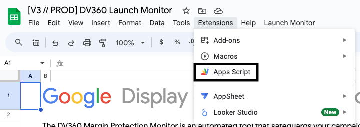

# Updating your Launch Monitor

This document will help those who use this repository to operationalize certain processes.

## Manually

When you want to update your code, you can manually do so. This is ideal for someone who can't follow the technical steps below and does not need to develop locally.

1. Navigate to the tool you want to use (e.g. [CM360](/cm360/)).
2. Find the template linked in the README and follow the link. You should see this screen.

.

3. Click on "**View Apps Script file**" then, for each file ending in **.gs**, copy the contents.

   a. Click on the code section and then Ctrl+A (Cmd+A on Mac) to select all
   

   b. Press Ctrl+C (Cmd+C on Mac) to copy.

4. [Navigate to Apps Script from your copy](#how-to-navigate-to-apps-script-from-your-spreadsheet)

   a. Find the equivalent **.gs** file in Apps Script, or create it if it doesn't exist.

   b. Press Ctrl+V (Cmd+V on Mac) to paste the contents into Apps Script.

   c. Press Ctrl+S (Cmd+S on Mac) to save.

## Clasp - The Technical Way

Clasp is a developer tool. It is useful for local developing, and it's how our code is deployed. If you're not very technical, the biggest benefit this offers is the ability to auto-update your code.

You do not need to be highly technical to use clasp, but access to a terminal is required. You can use anything with access to Linux or Unix, including Cloud Shell or Colab for all commands except `clasp login` which requires access to a browser on the same computer.

### Initializing Clasp

This is a one-time setup per project.

1. (_Note: this only has to happen one time per machine_).
   Log into clasp using this command. You need [npm](https://docs.npmjs.com/downloading-and-installing-node-js-and-npm) for this to work, but it is often included, so if you're not sure, you can try running this before installing NPM:

```
npx @google/clasp login
```

2. Navigate to the tool you want to use (e.g. [CM360](/cm360/)).
3. Use your copy of the template found in the README of the folder.
4. Run the following commands, replacing `[scriptId]` with [your script ID](#how-to-get-the-script-id-for-clasp)

```
npx @google/clasp clone [scriptId]
```

### Updating Clasp

Once `clasp` is initialized, updating is simple.

1. Find the path of the launch monitor you want to use (i.e. any from the [main README](/README.md#launch-monitors)),
2. Navigate to that directory.
3. Run `yarn push`.

## More Guides

### How to navigate to Apps Script from your spreadsheet

In your spreadsheet, go to **Extensions > Apps Script**



### How to get the Parent ID for clasp

1. In your spreadsheet, look at the URL bar. Manually select everything between **d/** and **/edit**.

   

2. Copy with Ctrl+C (Cmd+C on Mac).

3. You have your parent ID in your clipboard. YOu can paste it wherever you need it to go with Ctrl+V (Cmd+V on Mac).

### How to get the Script ID for clasp

1. [Navigate to Apps Script from your spreadsheet](#how-to-navigate-to-apps-script-from-your-spreadsheet)

2. Within Apps Script, locate the script ID in the URL bar. It is all of the information between **projects/** and **/edit**

   

3. Click in the highlighted section twice and it should select the entire ID. If any of the ID is not highlighted, manually drag from just after **projects/** until just before **/edit**. Copy with Ctrl+C (Cmd+C on Mac).

4. You have your script ID in your clipboard. You can paste it wherever you need it to go with Ctrl+V (Cmd+V on Mac).
