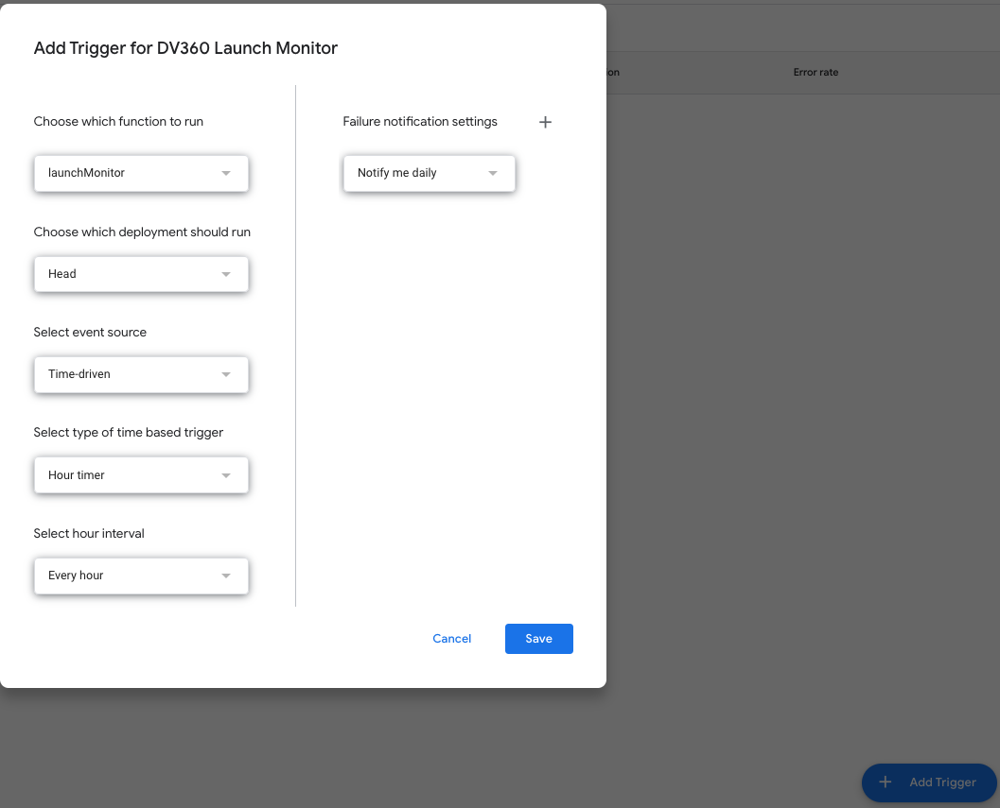
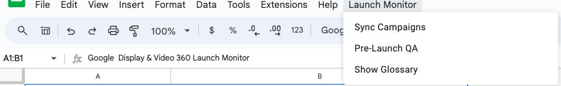

# DV360 Launch Monitor

The Display Video 360 Launch Monitor is a tool that identifies configuration errors and reported anomalies in DV360 and alerts users so that further manual checks can be made. The tool currently supports the following use cases:

- Geo Targeting settings check
- Geo Targeting impressions tracking
- Budget Pacing check

## One Time Setup

1. Make a copy of the [DV360 Launch Monitor template](https://docs.google.com/spreadsheets/d/1zpmA0tmVg-IzGgO5sxjwY8i0XM3bHzgpqOI9xkN35Ns/copy).
2. Follow the instructions for setting up in the sheet, including:
   1. Attach a Google Cloud Project project number to the Apps Script. This is required to interact with the DV360 API.
   2. Add an hourly trigger (or a cadence of your choosing) to run **launchMonitor**
      
3. Add your Agency ID or Advertiser ID under **General/Settings**. Note: Agency ID is **not recommended** for large agencies because it can exhaust time limits in Apps Script.
4. Manually run **Fetch Data** or **Pre-Launch QA** under the **Launch Monitor** menu in Google Sheets. You will probably need to do this twice: Once to authorize permissions Launch Monitor requests, and once to see results.
   
